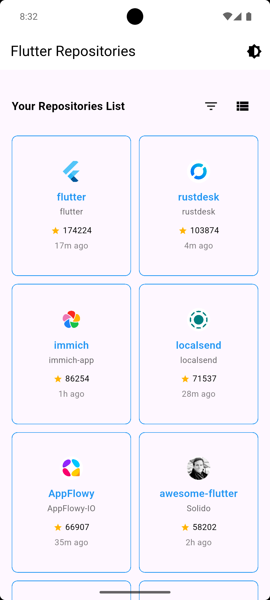
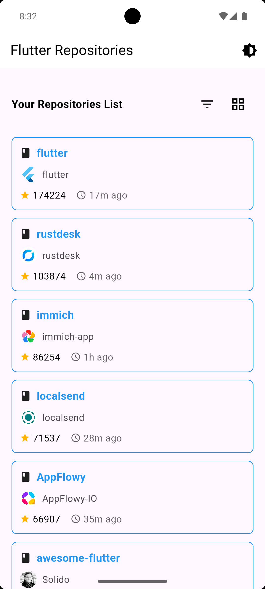
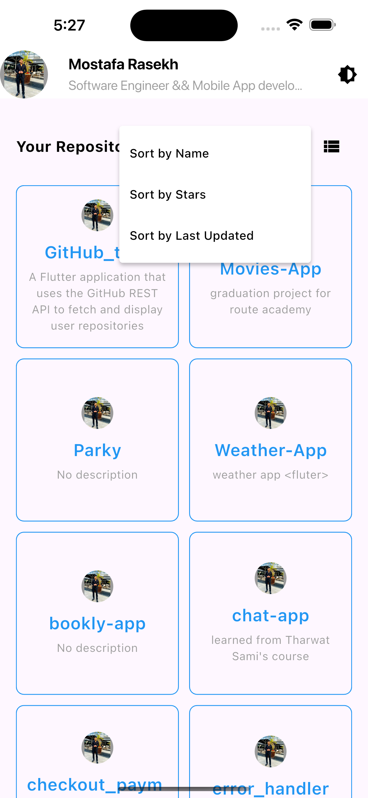
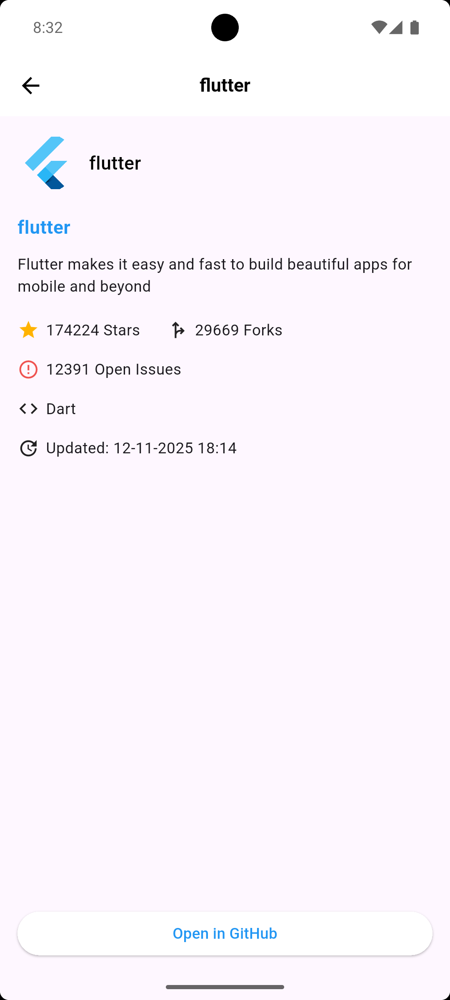
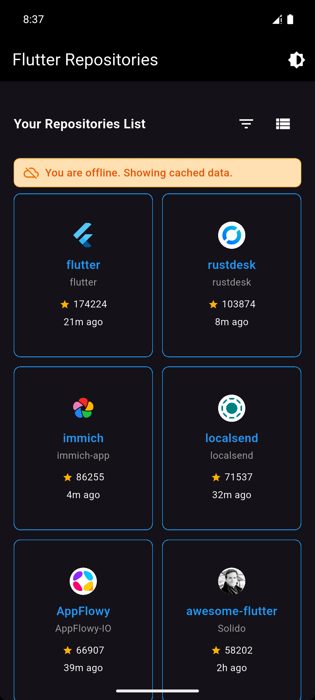
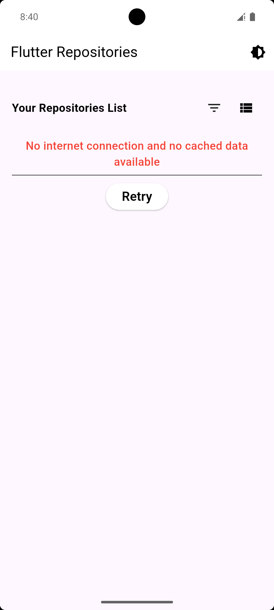

# 🚀 GitHub Repositories Explorer

A modern Flutter application that fetches and displays the top 50 most-starred Flutter repositories from GitHub with offline support, intelligent caching, and a beautiful UI.

## ✨ Features

### 🌐 GitHub API Integration
- Fetches **top 50 most-starred Flutter repositories** from GitHub Search API
- Displays repository name, owner, avatar, description, stars, forks, open issues, and last updated date
- Robust error handling for network failures, timeouts, and API rate limits

### 💾 Offline-First with Hive
- **Cache-First Strategy**: Instantly displays cached data on app launch
- Automatic background sync from GitHub API
- Full offline support - browse all repositories without internet
- Persistent local storage using Hive database

### 🔄 Pull-to-Refresh
- Swipe down to manually refresh data from GitHub API
- Seamless updates with smooth animations
- Works in both online and offline modes

### 📊 Persistent Sorting
- Sort repositories by:
  - ⭐ **Stars** (most popular first)
  - 📅 **Last Updated** (most recent first)  
  - 🔤 **Name** (alphabetical)
- Sorting preference saved and automatically applied on app restart

### 🎨 Modern UI/UX
- Dual view modes: **List View** and **Grid View**
- Smooth animations and page transitions
- Skeleton loading states with Skeletonizer
- Orange banner indicator when offline
- Relative time formatting ("2h ago", "3d ago")
- Beautiful color-coded stats (stars, forks, issues)

### 📱 Responsive Design
- Optimized for both mobile and tablet screens
- Adaptive layouts using ScreenUtil
- Material Design 3 theming support

## 📦 Key Packages

### State Management & Architecture
- **flutter_bloc ^8.1.3** - BLoC/Cubit state management
- **get_it ^7.2.0** - Dependency injection
- **dartz ^0.10.1** - Functional programming with Either type

### Networking
- **dio ^5.8.0+1** - HTTP client for API calls
- **pretty_dio_logger ^1.3.1** - Network request/response logging

### Local Storage
- **hive ^2.2.3** - Fast NoSQL database for offline storage
- **hive_flutter ^1.1.0** - Flutter integration for Hive
- **shared_preferences ^2.2.3** - Simple key-value storage for preferences

### UI & Animations
- **animations ^2.1.0** - Pre-built Material motion animations
- **page_transition ^2.1.0** - Custom page transitions
- **skeletonizer ^1.4.3** - Skeleton loading placeholders
- **flutter_screenutil ^5.9.0** - Responsive UI scaling
- **cached_network_image ^3.4.1** - Cached image loading
- **flutter_svg ^2.0.10+1** - SVG rendering support
- **flutter_spinkit ^5.2.1** - Loading indicators
- **flutter_bounceable ^1.2.0** - Bouncy button animations
- **dotted_border ^2.1.0** - Custom border styling

### Utilities
- **intl ^0.19.0** - Internationalization and date formatting
- **equatable ^2.0.5** - Value equality for models
- **permission_handler ^12.0.0+1** - Runtime permissions
- **url_launcher ^6.3.1** - Open external URLs

### Development
- **build_runner ^2.4.13** - Code generation runner
- **hive_generator ^2.0.1** - Hive TypeAdapter generation
- **flutter_lints ^3.0.0** - Dart linting rules

## 🏗️ Architecture

The app follows **Clean Architecture** principles with clear separation of concerns:

```
lib/
├── core/                       # Core utilities and helpers
│   ├── api/                   # API client (Dio)
│   ├── config/                # App configuration
│   ├── errors/                # Error handling
│   ├── helpers/               # Helper classes (Hive, Cache)
│   └── utils/                 # Utilities and widgets
│
├── features/
│   └── home/
│       ├── data/
│       │   ├── datasources/   # Remote (API) & Local (Hive)
│       │   ├── models/        # Data models with Hive adapters
│       │   └── repositories/  # Repository implementations
│       │
│       ├── domain/
│       │   ├── entities/      # Business entities
│       │   └── repositories/  # Repository interfaces
│       │
│       └── presentation/
│           ├── cubit/         # State management (Cubit)
│           ├── screens/       # UI screens
│           └── widgets/       # Reusable widgets
│
└── main.dart                  # App entry point
```

### Data Flow

**Cache-First Strategy:**
```
App Launch
    ↓
Load from Hive (instant) → Display Data
    ↓
Fetch from GitHub API (background)
    ↓
Update Hive Cache
    ↓
Update UI (if new data)
```

**Pull-to-Refresh:**
```
User Swipes Down
    ↓
Check Connectivity
    ↓
If Online → Fetch from API → Update Hive → Refresh UI
If Offline → Show Offline Banner (no errors)
```

## 🚀 Getting Started

### Prerequisites
- Flutter SDK 3.3.0 or higher
- Dart SDK 3.0.0 or higher

### Installation

1. **Clone the repository**
   ```bash
   git clone <repository-url>
   cd GitHub_task
   ```

2. **Install dependencies**
   ```bash
   flutter pub get
   ```

3. **Generate Hive adapters**
   ```bash
   flutter packages pub run build_runner build --delete-conflicting-outputs
   ```

4. **Run the app**
   ```bash
   flutter run
   ```

## 📱 Usage

### First Launch
- App fetches top 50 repositories from GitHub
- Data is automatically cached for offline use
- Default sorting applied

### Browsing Repositories
- **Tap** repository card to view details
- **Swipe down** to refresh from GitHub API
- **Tap grid/list icon** to switch view modes
- **Tap filter icon** to change sorting

### Offline Mode
- All cached repositories remain accessible
- Orange banner appears indicating offline status
- Pull-to-refresh available (updates when back online)
- No error messages - seamless offline experience

### Repository Details
Shows:
- Owner name and avatar
- Full description
- Stars count (⭐)
- Forks count
- Open issues (🔴)
- Programming language
- Last updated (formatted: MM-DD-YYYY HH:MM)
- "Open in GitHub" button

## 🎯 State Management

Uses **Cubit (flutter_bloc)** with the following states:

- `HomeInitial` - Initial state
- `HomeLoading` - Loading data (first time only)
- `HomeSuccess` - Data loaded successfully (online)
- `HomeOfflineLoaded` - Data loaded from cache (offline)
- `HomeFailure` - Error occurred (with retry option)
- `HomeGridToggled` - View mode changed

## 🔧 Configuration

### API Endpoint
Located in `lib/core/api/end_points.dart`:
```dart
static String repositories() {
  return "/search/repositories?q=Flutter&sort=stars&order=desc&per_page=50";
}
```

### Hive Storage
Managed in `lib/core/helpers/hive_helper.dart`:
- Repositories stored in `repositories_box`
- Settings stored in `settings_box`

## 📸 Screenshots

| | |
|---|---|
|  |  |
|  |  |
|  |  |

## 🤝 Contributing

Contributions are welcome! Please feel free to submit a Pull Request.

## 📄 License

This project is open source and available under the [MIT License](LICENSE).

## 👨‍💻 Developer

Developed with ❤️ using Flutter

---

### Key Highlights

✅ **Offline-First** - Works without internet  
✅ **Cache-First** - Instant load times  
✅ **Clean Architecture** - Maintainable codebase  
✅ **Cubit State Management** - Predictable state  
✅ **Hive Database** - Fast local storage  
✅ **Modern UI** - Beautiful and responsive  
✅ **Pull-to-Refresh** - Easy data updates  
✅ **Persistent Sorting** - Remembers your preferences

## 📷 Screenshots

| | |
|---|---|
|  |  |
|  |  |
|  |  |